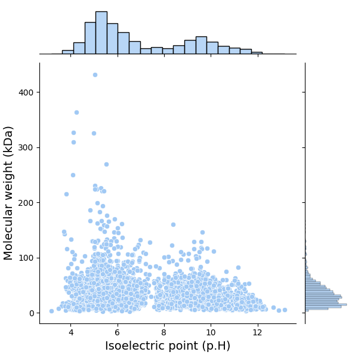
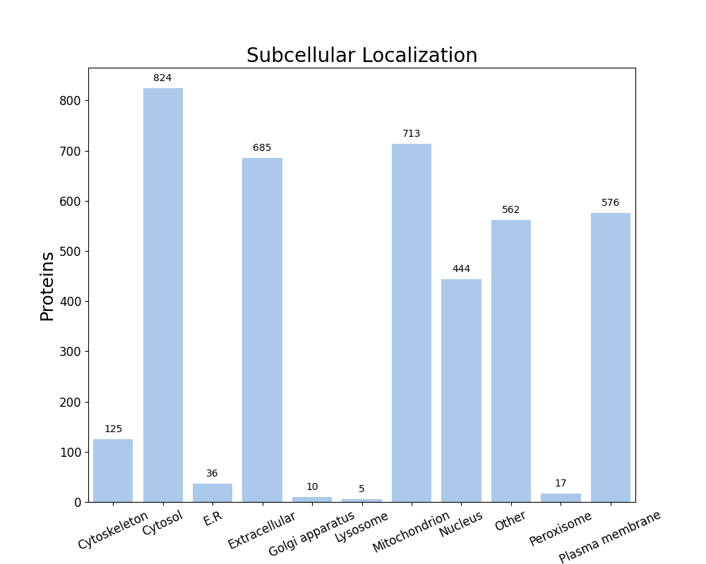

FastProtein Software 1.0
========================
##### Protein Information Software

---
### Summary
| Information                          | Value              |
| ------------------------------------ | ------------------ |
| Processed proteins                   | 3997               |
| Molecular mass (kda) mean            | 35.49 &#177; 27.55 |
| Isoelectric point mean               | 6.93 &#177; 2.14   |
| Hydrophicity mean                    | -0.03 &#177; 0.36  |
| Aromaticity mean                     | 0.06 &#177; 0.03   |
| Proteins with TM                     | 740                |
| Proteins with SP                     | 478                |
| Proteins with GPI                    | 50                 |
| Membrane proteins                    | 835                |
| Proteins with E.R Retention domains  | 444                |
| Proteins with NGlycosylation domains | 1852               |
### Molecular mass (kDa) vs Isoelectric point (pH)

---
### Subcellular localization (by WolfPSort) - Organism: animal

| Subcellular localization | Proteins |
| ------------------------ | -------- |
| Cytosol                  | 824      |
| Mitochondrion            | 713      |
| Extracellular            | 685      |
| Plasma membrane          | 576      |
| Other                    | 562      |
| Nucleus                  | 444      |
| Cytoskeleton             | 125      |
| E.R                      | 36       |
| Peroxisome               | 17       |
| Golgi apparatus          | 10       |
| Lysosome                 | 5        |
---
### E.R Retention domain summary
| Domain | Quantity |
| ------ | -------- |
| HDEL   | 25       |
| ADEL   | 88       |
| AEEL   | 75       |
| RNEL   | 13       |
| AQEL   | 30       |
| ANEL   | 22       |
| REEL   | 42       |
| SDEL   | 24       |
| RDEL   | 57       |
| SEEL   | 19       |
Only top 10

---
### NGlyc domain summary
| Domain | Quantity |
| ------ | -------- |
| NAT    | 206      |
| NAS    | 206      |
| NLS    | 167      |
| NLT    | 193      |
| NGT    | 179      |
| NVS    | 134      |
| NGS    | 213      |
| NVT    | 179      |
| NRS    | 131      |
| NTT    | 120      |
Only top 10

---
| Id         | Length |  kDa   | Isoelectric_Point | Hydropathy | Aromaticity |  Localization   | TMHMM_2 | Phobius_TM | PredGPI | Membrane_evidences | Membrane_evidences_detail |  SignalP5   | Phobius_SP | ER_Retention_Total | NGlyc_Total | ER_Retention_Domains |                                      NGlyc_Domains                                      |                       Header                       | Local_alignment_description | Gene_Ontology | Interpro_Annotation | PFAM_Annotation | Panther_Annotation |
| ---------- |:------:|:------:|:-----------------:|:----------:|:-----------:|:---------------:|:-------:|:----------:|:-------:|:------------------:|:-------------------------:|:-----------:|:----------:|:------------------:|:-----------:|:--------------------:|:---------------------------------------------------------------------------------------:|:--------------------------------------------------:| --------------------------- | ------------- | ------------------- | --------------- | ------------------ |
| A0A089QRB9 |  2085  | 220.46 |       5.34        |    0.02    |    0.06     |  Mitochondrion  |    0    |     0      |    -    |         0          |                           |      -      |     Y      |         0          |      3      |                      |                       NTS[396-399];NLS[1654-1657];NVT[1841-1844]                        |               Mycolipanoate synthase               | -                           |               |                     |                 |                    |
| I6WXK4     |  276   | 30.15  |       5.88        |   -0.32    |    0.06     |     Cytosol     |    0    |     0      |    -    |         0          |                           |      -      |     -      |         0          |      1      |                      |                                      NDS[192-195]                                       |    Triple specificity protein phosphatase PtpB     | -                           |               |                     |                 |                    |
| I6WZG6     |  265   | 28.83  |       4.90        |   -0.14    |    0.07     |      Other      |    0    |     0      |    -    |         0          |                           |      -      |     -      |         0          |      0      |                      |                                                                                         |          Type 1 encapsulin shell protein           | -                           |               |                     |                 |                    |
| I6WZK7     |  504   | 53.80  |       5.88        |   -0.17    |    0.07     |      Other      |    0    |     0      |    -    |         0          |                           |      -      |     Y      |         0          |      2      |                      |                                NTT[222-225];NTT[430-433]                                |              Multicopper oxidase MmcO              | -                           |               |                     |                 |                    |
| I6X235     |  207   | 22.89  |       5.25        |   -0.17    |    0.07     |     Cytosol     |    0    |     0      |    -    |         0          |                           |      -      |     -      |         0          |      0      |                      |                                                                                         |             ADP-ribose pyrophosphatase             | -                           |               |                     |                 |                    |
| I6X5W1     |  210   | 23.13  |       9.69        |    0.93    |    0.12     | Plasma membrane |    0    |     6      |    -    |         2          |    PHOBIUS_TM&#124;SL     |      -      |     -      |         0          |      0      |                      |                                                                                         |        Vitamin K epoxide reductase homolog         | -                           |               |                     |                 |                    |
| I6X8D2     |  1733  | 186.45 |       4.83        |   -0.19    |    0.07     | Plasma membrane |    0    |     1      |    -    |         2          |    PHOBIUS_TM&#124;SL     |      -      |     -      |         1          |      1      |    QDEL[748-752]     |                                     NVT[1590-1593]                                      |             Polyketide synthase Pks13              | -                           |               |                     |                 |                    |
| I6XD65     |  186   | 19.60  |       4.43        |    0.00    |    0.08     |  Extracellular  |    0    |     0      |    -    |         0          |                           |      -      |     -      |         0          |      1      |                      |                                      NGT[111-114]                                       |           Nicotinamidase/pyrazinamidase            | -                           |               |                     |                 |                    |
| I6XD69     |  4151  | 431.61 |       5.05        |    0.21    |    0.06     |     Nucleus     |    0    |     0      |    -    |         0          |                           |      -      |     -      |         0          |      6      |                      | NAT[232-235];NIT[1978-1981];NAT[2255-2258];NST[2637-2640];NVT[2801-2804];NET[4113-4116] |              Mycoketide-CoA synthase               | -                           |               |                     |                 |                    |
| I6XFS7     |  188   | 19.81  |       9.16        |    0.12    |    0.05     |  Mitochondrion  |    0    |     0      |    -    |         0          |                           |      -      |     -      |         0          |      0      |                      |                                                                                         |         RNA/DNA methyltransferase Rv2966c          | -                           |               |                     |                 |                    |
| I6XHI4     |  391   | 41.33  |       5.43        |   -0.04    |    0.04     |     Cytosol     |    0    |     0      |    -    |         0          |                           |      -      |     -      |         0          |      1      |                      |                                       NIS[68-71]                                        |          Steroid 3-ketoacyl-CoA thiolase           | -                           |               |                     |                 |                    |
| I6XU97     |  298   | 32.13  |       5.24        |   -0.11    |    0.06     |  Cytoskeleton   |    0    |     0      |    -    |         0          |                           |      -      |     -      |         0          |      1      |                      |                                       NYS[93-96]                                        |                  Esterase Rv0045c                  | -                           |               |                     |                 |                    |
| I6Y0R5     |  487   | 50.78  |       4.91        |    0.11    |    0.05     |  Cytoskeleton   |    0    |     0      |    -    |         0          |                           |      -      |     -      |         0          |      2      |                      |                                  NST[1-4];NGS[405-408]                                  | Dihydrofolate synthase/folylpolyglutamate synthase | -                           |               |                     |                 |                    |
| I6Y1Q2     |  228   | 24.95  |       5.07        |   -0.26    |    0.06     |  Cytoskeleton   |    0    |     0      |    -    |         0          |                           |      -      |     -      |         0          |      0      |                      |                                                                                         | Manganese-dependent transcriptional repressor MntR | -                           |               |                     |                 |                    |
| I6Y2J4     |  437   | 45.02  |       4.49        |    0.47    |    0.09     |     Nucleus     |    0    |     0      |    -    |         0          |                           |      -      |     -      |         0          |      3      |                      |                          NAS[94-97];NYS[253-256];NVS[301-304]                           |               Triacylglycerol lipase               | -                           |               |                     |                 |                    |
| I6Y3Q0     |  373   | 39.01  |       5.02        |    0.06    |    0.06     |     Nucleus     |    0    |     0      |    -    |         0          |                           |      -      |     -      |         0          |      0      |                      |                                                                                         |           Acyl-CoA dehydrogenase FadE27            | -                           |               |                     |                 |                    |
| I6Y4D2     |  241   | 24.84  |       9.30        |   -0.12    |    0.05     |  Extracellular  |    0    |     0      |    -    |         0          |                           | SP(Sec/SPI) |     Y      |         0          |      1      |                      |                                      NYS[138-141]                                       |     N-acetylmuramoyl-L-alanine amidase Rv3717      | -                           |               |                     |                 |                    |
| I6Y4U9     |  335   | 36.05  |       5.09        |   -0.08    |    0.07     |  Extracellular  |    0    |     0      |    -    |         0          |                           | SP(Sec/SPI) |     -      |         0          |      0      |                      |                                                                                         |            Dye-decolorizing peroxidase             | -                           |               |                     |                 |                    |
| I6Y778     |  454   | 46.83  |       6.04        |    0.07    |    0.05     |  Mitochondrion  |    0    |     0      |    -    |         0          |                           |      -      |     -      |         0          |      1      |                      |                                      NGS[332-335]                                       | 3-oxoacyl-[acyl-carrier-protein] reductase [NADH]  | -                           |               |                     |                 |                    |
| I6Y9J2     |  408   | 43.37  |       6.07        |   -0.12    |    0.08     |  Extracellular  |    0    |     1      |    -    |         1          |        PHOBIUS_TM         | SP(Sec/SPI) |     -      |         0          |      3      |                      |                         NAT[126-129];NTS[348-351];NVS[355-358]                          |                L,D-transpeptidase 2                | -                           |               |                     |                 |                    |
| I6Y9Q3     |  393   | 42.97  |       8.61        |   -0.06    |    0.07     |     Cytosol     |    0    |     0      |    -    |         0          |                           |      -      |     -      |         0          |      1      |                      |                                      NAS[209-212]                                       |              2-methylcitrate synthase              | -                           |               |                     |                 |                    |
| I6YBQ3     |  150   | 16.51  |       5.39        |   -0.13    |    0.04     |      Other      |    0    |     0      |    -    |         0          |                           |      -      |     -      |         0          |      0      |                      |                                                                                         |      HTH-type transcriptional regulator LrpA       | -                           |               |                     |                 |                    |
| I6YCA3     |  400   | 43.78  |       6.63        |   -0.25    |    0.08     |     Cytosol     |    0    |     0      |    -    |         0          |                           |      -      |     -      |         1          |      0      |      QEEL[8-12]      |                                                                                         |           Acyl-CoA dehydrogenase FadE26            | -                           |               |                     |                 |                    |
| I6YFP0     |  266   | 28.12  |       5.96        |    0.06    |    0.03     | Plasma membrane |    0    |     0      |    -    |         1          |            SL             |      -      |     -      |         0          |      1      |                      |                                      NVT[157-160]                                       |      Biotin--[acetyl-CoA-carboxylase] ligase       | -                           |               |                     |                 |                    |
| I6YG32     |  158   | 17.39  |       7.91        |   -0.39    |    0.09     |  Extracellular  |    0    |     0      |    -    |         0          |                           |      -      |     -      |         0          |      0      |                      |                                                                                         |           N-alpha-acetyltransferase RimI           | -                           |               |                     |                 |                    |
| I6YHB0     |  134   | 13.82  |       10.59       |   -0.54    |    0.00     | Plasma membrane |    0    |     1      |    -    |         2          |    PHOBIUS_TM&#124;SL     |      -      |     -      |         0          |      1      |                      |                                      NAS[100-103]                                       |            Histone-like protein Rv3852             | -                           |               |                     |                 |                    |
##### Only top 10 proteins

---

##### Do you have a question or tips? Please contact us! E-mail: renato.simoes@ifsc.edu.br
Generated time: Sun Sep 27 23:17:54 UTC 2026